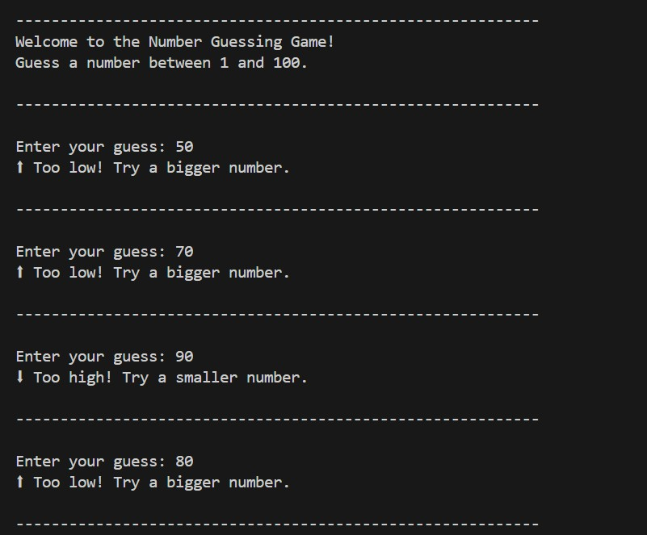
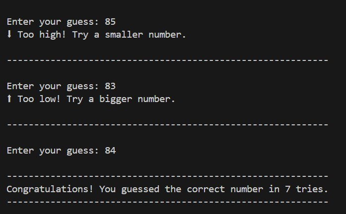

# Number Guessing CLI Game

A beginner‑friendly, fully interactive **Python command-line game** where the player guesses a randomly generated number between **1 and 100**. The program validates inputs, gives hints (higher/lower), and counts the total number of attempts.

---

## 🎯 Features

* ✔ Random number generation (1–100)
* ✔ CLI-friendly interface
* ✔ Input validation (numbers only)
* ✔ Range validation (1–100)
* ✔ Helpful hints: *Too High* / *Too Low*
* ✔ Tracks number of attempts
* ✔ Clean, readable Python code

---

## 📸 Demo / Screenshots

Here are screenshots of the game running:



):


---

## 🚀 How to Run

Make sure Python is installed.

```bash
python number_guessing.py
```

---

## 📂 Project Structure

```
number-guessing-cli/
│── number_guessing.py
│── README.md
│── terminal-1.jpg
│── terminal-2.jpg
└── License

```

---

## 🧠 Game Logic (Summary)

1. Generates a random number between **1 and 100**.
2. Repeats until the user guesses correctly.
3. Validates user input (must be a number).
4. Gives directional hints.
5. Counts attempts.
6. Prints success message.

---

## 📝 Code Used

```python
import random

num = random.randint(1, 100)
tries = 0

print("\n-----------------------------------------------------------")
print("Welcome to the Number Guessing Game!")
print("Guess a number between 1 and 100.\n")

while True:
    print("-----------------------------------------------------------\n")
    user_input = input("Enter your guess: ")

    if not user_input.isdigit():
        print("Invalid input! Please enter a number only.\n")
        continue

    guessed = int(user_input)

    if guessed < 1 or guessed > 100:
        print("⚠ Please enter a number between 1 and 100 only.\n")
        continue

    tries += 1

    if guessed == num:
        print("\n-----------------------------------------------------------")
        print(f"Congratulations! You guessed the correct number in {tries} tries.")
        print("-----------------------------------------------------------\n")
        break
    elif guessed > num:
        print("⬇ Too high! Try a smaller number.\n")
    else:
        print("⬆ Too low! Try a bigger number.\n")
```


## 📜 License

MIT
